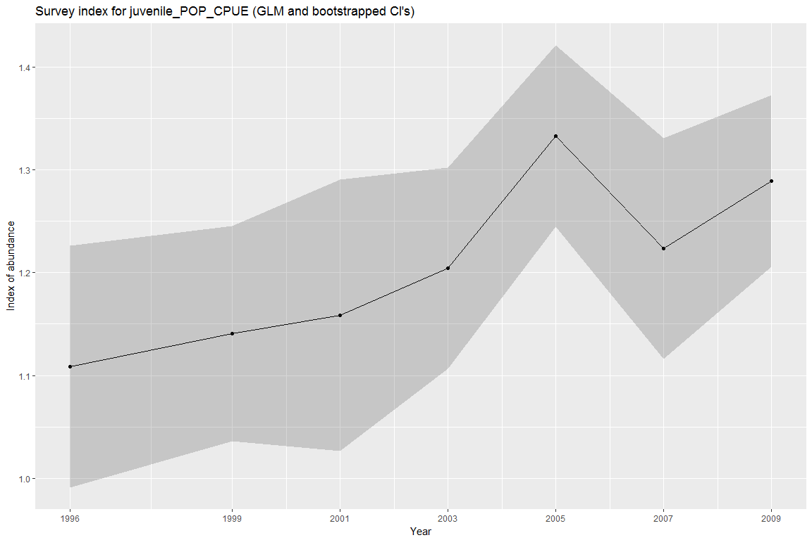
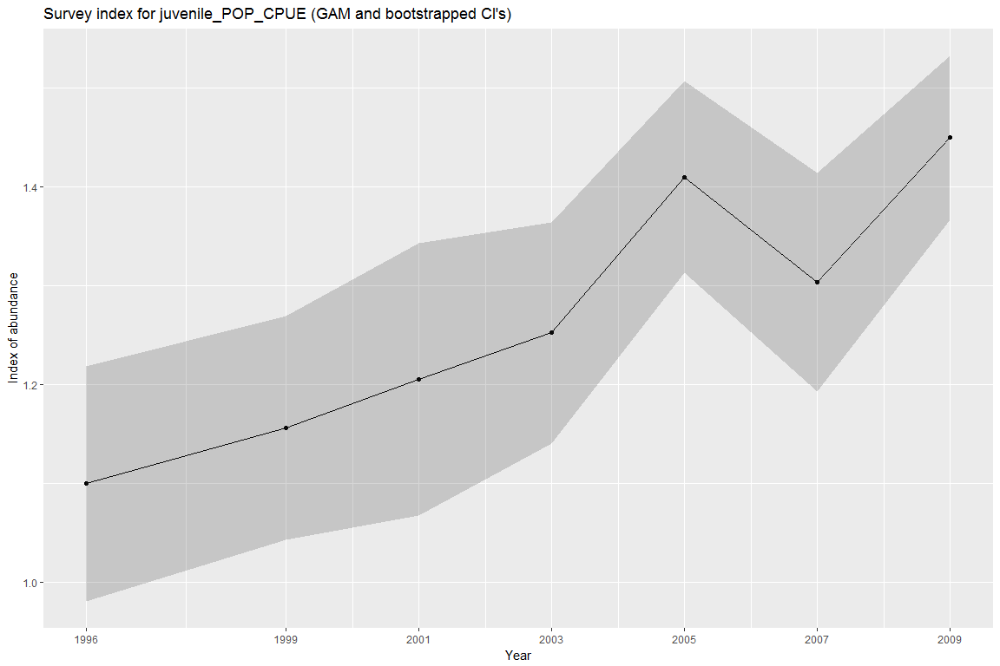
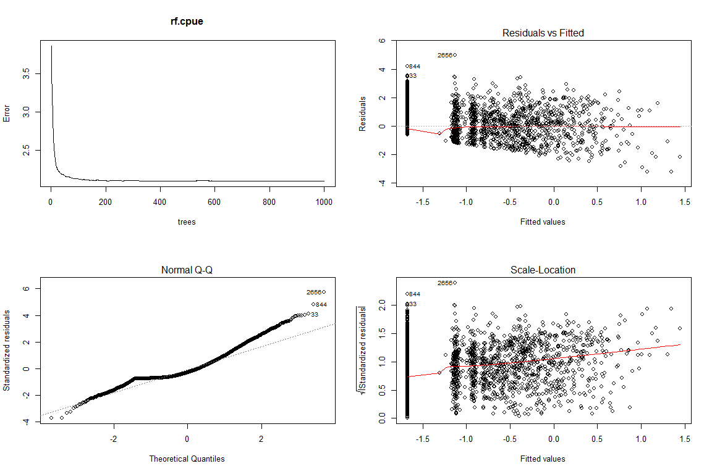
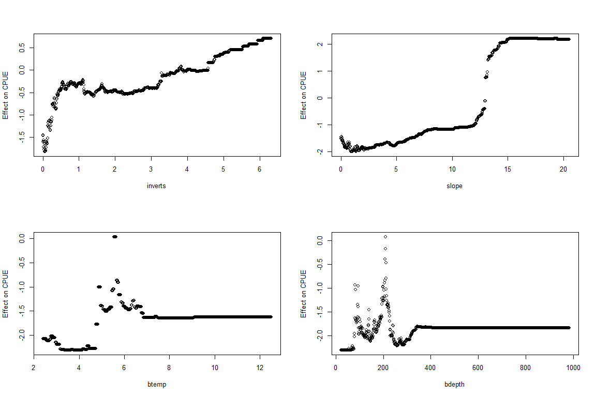

Habitat Model Abundance Indices estimated from RACE Bottom Trawl Survey using GLM, GAM and Random Forest
================
Chris Rooper
June 15, 2018

Purpose
-------

The purpose of this code is to make GLM, GAM and Random Forest models based on habitat variables. These models are then used to compute model based estimates of abundance for fishes in the Aleutian Islands and Gulf of Alaska. The code takes bottom trawl survey data and habitat variables from RacebaseExtract.R code. The package produces annual abundance estimates with errors (either by the Delta method or bootstrapping).

------------------------------------------------------------------------

Setup data
----------

### Define species of interest and habitat variables

This code is designed to be run with output from RACEBASE (or other data source) where rows represent hauls to be used in the calculation of the survey index and columns indicate CPUE for species (zero-filled data), habitat and other variables. An example is the data included for juvenile Pacific Ocean perch included (the same data as in the MEHRSI package).

``` r
data("Juvenile_POP_Data")
pandoc.table(head(Juvenile_POP_Data),caption="Example RACEBASE extract for juvenile POP catches in the Gulf of Alaska",split.table=Inf)
```

    ## 
    ## ---------------------------------------------------------------------------------------------------------------------------------
    ##  hauljoin    lat     long    year   tdepth   btemp   bdepth   slope     inverts    ttemp   shrimp    juvenile_POP_CPUE   STRATUM 
    ## ---------- ------- -------- ------ -------- ------- -------- -------- ----------- ------- --------- ------------------- ---------
    ##   881077    56.14   -135.2   1996    9.4      4.4     291     1.882        0       11.8    0.01286           0             250   
    ## 
    ##   881078    55.92   -135.4   1996    25.4     4.9     275     6.926     0.6885     11.56    1.955          5.518           251   
    ## 
    ##   881079    55.93   -135.4   1996    36.4     4.2     369     8.288      0.18      10.77      0              0             351   
    ## 
    ##   881080    55.93   -134.9   1996    10.4     5.4     180     0.7038    0.8072     10.95   0.05597         8.795           151   
    ## 
    ##   881081    55.89   -134.6   1996    14.4     8.1      85       0      0.0004213   9.916      0              0             50    
    ## 
    ##   881082    55.66   -134.6   1996    20.4     5.5     206     0.4036       0       12.05   0.02139        0.3564           251   
    ## ---------------------------------------------------------------------------------------------------------------------------------
    ## 
    ## Table: Example RACEBASE extract for juvenile POP catches in the Gulf of Alaska

In this data you have a column for the haul identifier, the midpoint positions of the tow, a year variable indicating the survey year, the depth of the thermocline, the bottom temperature and bottom depth and the seafloor slope. The catch of structure forming invertebrates (coral and sponge), the termperature at the thermocline and the total catch of shrimp are also included as potential habitat variables. The final column is the CPUE of juvenile Pacific Ocean perch (in kg/ha). For this analysis, POP were considered juveniles if they were &lt; 250 mm in length.

For both the GLM and GAM approaches, we will use a compound model that predicts a binary process (presence or absence) and a log-normal process with habitat covariates. The models both assume a Delta Log-Normal distribution for the data.

First we do a little data manipulation to ID the data set to be used for presence-absence modeling and the subset of data with positive catches only for use in the log-normal model. The species names are set up for easy looping if you have multiple species in the same data set. In this case the "species.name" variable can include a vector of species names corresponding to column names in the data set. Then you could just loop around the entire code below, with some additonal code to capture the model outputs.

``` r
PA.data<-Juvenile_POP_Data
species.name<-c("juvenile_POP_CPUE")
CPUE.data<-subset(PA.data,PA.data[species.name]>0)
```

GENERAL LINEAR MODEL
====================

Presence-absence model
----------------------

For the presence and absence model we specify the x and y variables and set up the formula. In this case we have chosen 4 x variables and converted the CPUE data to presence (1) or absence (0). It is important to include year as a factor in the formula so that the annual abundance index can be predicted.

``` r
glm.pa.xvars<-c("inverts","slope","btemp","bdepth")
glm.pa.yvar<-ifelse(PA.data[species.name]>0,1,0)
glm.pa.form <- as.formula(paste("glm.pa.yvar ~", paste(glm.pa.xvars,collapse="+"),"+as.factor(year)",sep=""))
```

Next, we fit the initial glm model using a binomial distribution. We use backwards term selection based on the model AIC to remove insignificant terms in the equation. The best-fitting model is determined when the removal of additional terms results in no improvement to the AIC.

``` r
for(i in 1:length(glm.pa.xvars)){
pa.glm <- glm(glm.pa.form, family = binomial, data = PA.data)
gcv_glm<-pa.glm$aic
    pvals<-summary(pa.glm)$coefficients[2:(length(glm.pa.xvars)+1),4]
    least_sig<-which.max(pvals)

glm.pa.xvars1<-glm.pa.xvars[-least_sig]
glm.pa.form1 <- as.formula(paste("glm.pa.yvar ~", paste(glm.pa.xvars1,collapse="+"),"+as.factor(year)",sep=""))
pa.glm1 <- glm(glm.pa.form1, family = binomial, data =PA.data)
gcv_glm1<-pa.glm1$aic

if(gcv_glm1<gcv_glm){
    glm.pa.form<-glm.pa.form1
#   gcv_glm<-gcv_glm1
    glm.pa.xvars<-glm.pa.xvars1
}
if(gcv_glm1>=gcv_glm)break}
pander(summary(pa.glm),split.table=Inf, caption="Best-fitting model of Juvenile POP presence or absence")
```

<table>
<colgroup>
<col width="36%" />
<col width="16%" />
<col width="18%" />
<col width="13%" />
<col width="15%" />
</colgroup>
<thead>
<tr class="header">
<th align="center"> </th>
<th align="center">Estimate</th>
<th align="center">Std. Error</th>
<th align="center">z value</th>
<th align="center">Pr(&gt;|z|)</th>
</tr>
</thead>
<tbody>
<tr class="odd">
<td align="center"><strong>(Intercept)</strong></td>
<td align="center">-1.125</td>
<td align="center">0.1154</td>
<td align="center">-9.747</td>
<td align="center">1.896e-22</td>
</tr>
<tr class="even">
<td align="center"><strong>inverts</strong></td>
<td align="center">0.6468</td>
<td align="center">0.05808</td>
<td align="center">11.14</td>
<td align="center">8.386e-29</td>
</tr>
<tr class="odd">
<td align="center"><strong>slope</strong></td>
<td align="center">0.08109</td>
<td align="center">0.01702</td>
<td align="center">4.765</td>
<td align="center">1.885e-06</td>
</tr>
<tr class="even">
<td align="center"><strong>bdepth</strong></td>
<td align="center">-0.002824</td>
<td align="center">0.0003955</td>
<td align="center">-7.141</td>
<td align="center">9.265e-13</td>
</tr>
<tr class="odd">
<td align="center"><strong>as.factor(year)1999</strong></td>
<td align="center">0.0658</td>
<td align="center">0.1405</td>
<td align="center">0.4683</td>
<td align="center">0.6396</td>
</tr>
<tr class="even">
<td align="center"><strong>as.factor(year)2001</strong></td>
<td align="center">0.147</td>
<td align="center">0.1592</td>
<td align="center">0.9234</td>
<td align="center">0.3558</td>
</tr>
<tr class="odd">
<td align="center"><strong>as.factor(year)2003</strong></td>
<td align="center">0.2812</td>
<td align="center">0.1358</td>
<td align="center">2.071</td>
<td align="center">0.03835</td>
</tr>
<tr class="even">
<td align="center"><strong>as.factor(year)2005</strong></td>
<td align="center">0.6573</td>
<td align="center">0.1309</td>
<td align="center">5.023</td>
<td align="center">5.091e-07</td>
</tr>
<tr class="odd">
<td align="center"><strong>as.factor(year)2007</strong></td>
<td align="center">0.1486</td>
<td align="center">0.1381</td>
<td align="center">1.076</td>
<td align="center">0.2819</td>
</tr>
<tr class="even">
<td align="center"><strong>as.factor(year)2009</strong></td>
<td align="center">0.4808</td>
<td align="center">0.1282</td>
<td align="center">3.752</td>
<td align="center">0.0001757</td>
</tr>
</tbody>
</table>

(Dispersion parameter for binomial family taken to be 1 )

<table style="width:67%;">
<colgroup>
<col width="29%" />
<col width="37%" />
</colgroup>
<tbody>
<tr class="odd">
<td align="center">Null deviance:</td>
<td align="center">5155 on 4474 degrees of freedom</td>
</tr>
<tr class="even">
<td align="center">Residual deviance:</td>
<td align="center">4907 on 4465 degrees of freedom</td>
</tr>
</tbody>
</table>

Using the best-fitting model we plot the typical data checks, residuals, and the observed and predicted values.

``` r
par(mfrow=c(2,2))
plot(pa.glm)
```


``` r
par(mfrow=c(1,1))
pa.glm.data<-data.frame(pa.glm$y,pa.glm$fitted.values,pa.glm$data$year)
ggplot(pa.glm.data,aes(x=as.factor(pa.glm.data.year),y=pa.glm.fitted.values,fill=as.factor(pa.glm.y)))+geom_violin()+geom_boxplot(width=.1,position=position_dodge(.9))+xlab("Absence or Presence")+ylab("Predicted probability of presence")+scale_fill_brewer(palette="Blues")+theme(legend.position="none")
```


ABUNDANCE MODEL
---------------

For the abundance model we specify the x and y variables and set up the formula. In this case we have chosen the same 4 x variables as the presence-absence model (this doesn't have to be true) and log-transformed the CPUE data. Again, it is important to include year as a factor in the formula so that the annual abundance index can be predicted.

``` r
glm.cpue.yvar<-unlist(log(CPUE.data[species.name]))
glm.cpue.xvars<-c("inverts","slope","btemp","bdepth")
glm.cpue.form <- as.formula(paste("glm.cpue.yvar ~", paste(glm.cpue.xvars,collapse="+"),"+as.factor(year)",sep=""))
```

Next, we fit the initial glm model using a guassian distribution. We use backwards term selection based on the model AIC to remove insignificant terms in the equation. The best-fitting model is determined when the removal of additional terms results in no improvement to the AIC.

``` r
for(i in 1:length(glm.cpue.xvars)){
cpue.glm <- glm(glm.cpue.form, family = gaussian, data = CPUE.data)
gcv_glm<-cpue.glm$aic
    pvals<-summary(cpue.glm)$coefficients[2:(length(glm.cpue.xvars)+1),4]
    least_sig<-which.max(pvals)

glm.cpue.xvars1<-glm.cpue.xvars[-least_sig]
glm.cpue.form1 <- as.formula(paste("glm.cpue.yvar ~", paste(glm.cpue.xvars1,collapse="+"),"+as.factor(year)",sep=""))
cpue.glm1 <- glm(glm.cpue.form1, family = gaussian, data =CPUE.data)
gcv_glm1<-cpue.glm1$aic

if(gcv_glm1<gcv_glm){
    glm.cpue.form<-glm.cpue.form1
#   gcv_glm<-gcv_glm1
    glm.cpue.xvars<-glm.cpue.xvars1
}
if(gcv_glm1>=gcv_glm)break}
print(summary(cpue.glm))
```

    ## 
    ## Call:
    ## glm(formula = glm.cpue.form, family = gaussian, data = CPUE.data)
    ## 
    ## Deviance Residuals: 
    ##    Min      1Q  Median      3Q     Max  
    ## -3.374  -1.256  -0.166   1.049   5.953  
    ## 
    ## Coefficients:
    ##                     Estimate Std. Error t value
    ## (Intercept)          -0.8093     0.3731   -2.17
    ## inverts               0.3729     0.0570    6.54
    ## slope                 0.0905     0.0176    5.13
    ## btemp                 0.2612     0.0630    4.14
    ## as.factor(year)1999   0.1196     0.1894    0.63
    ## as.factor(year)2001   0.1529     0.2126    0.72
    ## as.factor(year)2003   0.2530     0.1818    1.39
    ## as.factor(year)2005   0.3935     0.1714    2.30
    ## as.factor(year)2007   0.4218     0.1875    2.25
    ## as.factor(year)2009   0.3966     0.1714    2.31
    ##                     Pr(>|t|)    
    ## (Intercept)            0.030 *  
    ## inverts              9.2e-11 ***
    ## slope                3.4e-07 ***
    ## btemp                3.7e-05 ***
    ## as.factor(year)1999    0.528    
    ## as.factor(year)2001    0.472    
    ## as.factor(year)2003    0.164    
    ## as.factor(year)2005    0.022 *  
    ## as.factor(year)2007    0.025 *  
    ## as.factor(year)2009    0.021 *  
    ## ---
    ## Signif. codes:  
    ## 0 '***' 0.001 '**' 0.01 '*' 0.05 '.' 0.1 ' ' 1
    ## 
    ## (Dispersion parameter for gaussian family taken to be 2.44)
    ## 
    ##     Null deviance: 3087.6  on 1175  degrees of freedom
    ## Residual deviance: 2841.5  on 1166  degrees of freedom
    ## AIC: 4397
    ## 
    ## Number of Fisher Scoring iterations: 2

Using the best-fitting model we plot the typical data checks, residuals, and the observed and predicted values.

``` r
par(mfrow=c(2,2))
plot(cpue.glm)
```


``` r
par(mfrow=c(1,1))
cpue.glm.data<-data.frame(cpue.glm$y,cpue.glm$fitted.values,cpue.glm$data$year)

ggplot(cpue.glm.data,aes(x=cpue.glm.y,y=cpue.glm.fitted.values,color=as.factor(cpue.glm.data.year)))+geom_point()+xlab("Observed CPUE")+ylab("Predicted CPUE")+theme(legend.position="right",legend.title=element_blank(),panel.background=element_blank())+geom_smooth(method="lm",formula=y~x,se=FALSE)
```


``` r
calc_RMSE(cpue.glm$y,cpue.glm$fitted.values)
```

    ## [1] 1.55

COMBINING GLMs INTO ESTIMATE
----------------------------

The next step in computing the annual index of abundance is to predict the value of CPUE in each year, holding the other variables constant at their median values. For each year, it is important to generate a variance estimate. In this package you can do this either by bootstrapping or by the delta method.

For the delta method use the "predict.glm.index" function. This will take the two models (for presence-absence and abundance), combine them to create the index of abundance (pa.glm\*cpue.glm with x variables held at their median values). It will output a table of year, estimate and 95% confidence intervals (based on the delta-method) for the survey data.

``` r
glm.index<-predict.glm.index(pa.glm,cpue.glm)

pander::pandoc.table(glm.index,row.names=FALSE,digits=4, caption="Survey abundance index using Delta-lognormal GLM and delta-method for estimating confidence intervals")
```

    ## 
    ## -----------------------------------------
    ##  years   glm.index   lower_CI   upper_CI 
    ## ------- ----------- ---------- ----------
    ##  1996      1.109      0.9617     1.278   
    ## 
    ##  1999      1.141      0.9919     1.311   
    ## 
    ##  2001      1.158      0.9921     1.353   
    ## 
    ##  2003      1.204      1.042      1.392   
    ## 
    ##  2005      1.333      1.145      1.552   
    ## 
    ##  2007      1.223       1.06      1.412   
    ## 
    ##  2009      1.289      1.116      1.489   
    ## -----------------------------------------
    ## 
    ## Table: Survey abundance index using Delta-lognormal GLM and delta-method for estimating confidence intervals

``` r
p<-ggplot(glm.index,aes(x=years,y=glm.index))+geom_line()+geom_point()+
  geom_ribbon(aes(ymin=lower_CI, ymax=upper_CI),
              alpha=0.2)+xlab("Year")+ylab("Index of abundance")+scale_x_continuous(breaks=glm.index$years)+ggtitle(paste("Survey index for ",species.name, " (GLM and Delta method CI's)",sep=""))
p
```

 For the bootstrapping method use the "predict.glm.bindex" function. This will take the two models (for presence-absence and abundance), combine them to create the index of abundance (pa.glm\*cpue.glm with x variables held at their median values). It will output a table of year, estimate and 95% confidence intervals (based on the bootstrap) for the survey data. You can specify the number of bootstraps in the predict.glm.bindex function by setting boot\_reps=..., otherwise the default is 500 replicates.

``` r
glm.indexb<-predict.glm.bindex(pa.glm,cpue.glm)

pander::pandoc.table(glm.indexb,row.names=FALSE,digits=4,caption="Survey abundance index using Delta-lognormal GLM and bootstrapping method for estimating confidence intervals")
```

    ## 
    ## -------------------------------------------------
    ##  years   glm.index   lower_bootCI   upper_bootCI 
    ## ------- ----------- -------------- --------------
    ##  1996      1.109        0.9936         1.224     
    ## 
    ##  1999      1.141        1.034          1.247     
    ## 
    ##  2001      1.158        1.015          1.301     
    ## 
    ##  2003      1.204        1.105          1.304     
    ## 
    ##  2005      1.333        1.238          1.427     
    ## 
    ##  2007      1.223        1.118          1.329     
    ## 
    ##  2009      1.289        1.209          1.369     
    ## -------------------------------------------------
    ## 
    ## Table: Survey abundance index using Delta-lognormal GLM and bootstrapping method for estimating confidence intervals

``` r
p<-ggplot(glm.indexb,aes(x=years,y=glm.index))+geom_line()+geom_point()+
  geom_ribbon(aes(ymin=lower_bootCI, ymax=upper_bootCI),
              alpha=0.2)+xlab("Year")+ylab("Index of abundance")+scale_x_continuous(breaks=glm.index$years)+ggtitle(paste("Survey index for ",species.name, " (GLM and bootstrapped CI's)",sep=""))
p
```



At this point we have generated a glm estimate of the abundance of our species using the delta-lognormal method.

------------------------------------------------------------------------

GENERALIZED ADDITIVE MODEL
==========================

The next step is to generate the survey index using a delta-GAM method. It follows a parallel process to the glm, with some minor tweaks to adjust inputs and outputs for the various functions. The GAM models are generated using the mgcv package (Wood 2006)

Presence-absence model
----------------------

For the presence and absence model we specify the x and y variables and set up the formula. In this case we have chosen 4 x variables and converted the CPUE data to presence (1) or absence (0). It is important to include year as a factor in the formula so that the annual abundance index can be predicted. Habitat variables are included as part of the formula with an s() indicating fitting a smooth spline to the data, k=4 is used here to reduce the number of inflection points in the smooth fit. Since it is presence absence data, a binomial distribution and link=logit is used.

``` r
gam.pa.xvars<-c("s(inverts,k=4)","s(slope,k=4)","s(btemp,k=4)","s(bdepth,k=4)")
gam.pa.yvar<-ifelse(PA.data[species.name]>0,1,0)
gam.pa.form <-as.formula(paste("gam.pa.yvar ~", paste(gam.pa.xvars,collapse="+"),"+as.factor(year)",sep=""))
```

Next we fit the GAM to the presence-absence data and then iteratively reduce the model to its most parsimonious form by removing insignificant habitat variables. See Weinberg and Kotwicki 2009 for the details on variable removal.

``` r
for(i in 1:length(gam.pa.xvars)){
pa.gam <- gam(gam.pa.form, family = binomial, data = PA.data,control=list(keepData=TRUE))
gcv_gam<-pa.gam$gcv.ubre
    pvals<-summary(pa.gam)$s.pv
    least_sig<-which.max(pvals)

gam.pa.xvars1<-gam.pa.xvars[-least_sig]
gam.pa.form1 <- as.formula(paste("gam.pa.yvar ~", paste(gam.pa.xvars1,collapse="+"),"+as.factor(year)",sep=""))
pa.gam1 <- gam(gam.pa.form1, family = binomial, data =PA.data)
gcv_gam1<-pa.gam1$gcv.ubre

pts1<-ifelse(gcv_gam>gcv_gam1,1,0)
pts2<-ifelse(round(summary(pa.gam)$edf[least_sig],1)==1,1,0)
pts3<-ifelse(summary(pa.gam)$s.pv[least_sig]>.05,1,0)
if(pts1+pts2+pts3>1){
    gam.pa.form<-gam.pa.form1
    gam.pa.xvars<-gam.pa.xvars1}
if(pts1+pts2+pts3<2)break}
print(summary(pa.gam))
```

    ## 
    ## Family: binomial 
    ## Link function: logit 
    ## 
    ## Formula:
    ## gam.pa.yvar ~ s(inverts, k = 4) + s(slope, k = 4) + s(btemp, 
    ##     k = 4) + s(bdepth, k = 4) + as.factor(year)
    ## 
    ## Parametric coefficients:
    ##                     Estimate Std. Error z value
    ## (Intercept)           -2.914      0.450   -6.47
    ## as.factor(year)1999    0.350      0.154    2.27
    ## as.factor(year)2001    0.365      0.172    2.12
    ## as.factor(year)2003    0.484      0.149    3.25
    ## as.factor(year)2005    0.897      0.145    6.20
    ## as.factor(year)2007    0.490      0.154    3.19
    ## as.factor(year)2009    1.003      0.144    6.98
    ##                     Pr(>|z|)    
    ## (Intercept)          9.8e-11 ***
    ## as.factor(year)1999   0.0229 *  
    ## as.factor(year)2001   0.0336 *  
    ## as.factor(year)2003   0.0011 ** 
    ## as.factor(year)2005  5.5e-10 ***
    ## as.factor(year)2007   0.0014 ** 
    ## as.factor(year)2009  3.1e-12 ***
    ## ---
    ## Signif. codes:  
    ## 0 '***' 0.001 '**' 0.01 '*' 0.05 '.' 0.1 ' ' 1
    ## 
    ## Approximate significance of smooth terms:
    ##             edf Ref.df Chi.sq p-value    
    ## s(inverts) 2.93   3.00  178.9 < 2e-16 ***
    ## s(slope)   2.74   2.95   27.5 3.8e-06 ***
    ## s(btemp)   2.94   3.00   39.0 1.6e-08 ***
    ## s(bdepth)  2.09   2.20  127.8 1.6e-08 ***
    ## ---
    ## Signif. codes:  
    ## 0 '***' 0.001 '**' 0.01 '*' 0.05 '.' 0.1 ' ' 1
    ## 
    ## R-sq.(adj) =   0.23   Deviance explained = 21.1%
    ## UBRE = -0.083632  Scale est. = 1         n = 4475

Using the best-fitting model we plot the typical data checks, residuals, and the observed and predicted values.

``` r
par(mfrow=c(2,2))
gam.check(pa.gam)
```


    ## 
    ## Method: UBRE   Optimizer: outer newton
    ## full convergence after 8 iterations.
    ## Gradient range [-4.54e-08,1.33e-07]
    ## (score -0.0836 & scale 1).
    ## Hessian positive definite, eigenvalue range [2.47e-05,0.0222].
    ## Model rank =  19 / 19 
    ## 
    ## Basis dimension (k) checking results. Low p-value (k-index<1) may
    ## indicate that k is too low, especially if edf is close to k'.
    ## 
    ##              k'  edf k-index p-value    
    ## s(inverts) 3.00 2.93    0.91  <2e-16 ***
    ## s(slope)   3.00 2.74    0.90  <2e-16 ***
    ## s(btemp)   3.00 2.94    0.91  <2e-16 ***
    ## s(bdepth)  3.00 2.09    0.98     0.2    
    ## ---
    ## Signif. codes:  
    ## 0 '***' 0.001 '**' 0.01 '*' 0.05 '.' 0.1 ' ' 1

``` r
plot(pa.gam,scale=0,shade=TRUE,all.terms=TRUE,pages=1)
```


``` r
par(mfrow=c(1,1))
pa.gam.data<-data.frame(pa.gam$y,pa.gam$fitted.values,pa.gam$data$year)
ggplot(pa.gam.data,aes(x=as.factor(pa.gam.data.year),y=pa.gam.fitted.values,fill=as.factor(pa.gam.data[,1])))+geom_violin()+geom_boxplot(width=.1,position=position_dodge(.9))+xlab("Absence or Presence")+ylab("Predicted probability of presence")+scale_fill_brewer(palette="Blues")+theme(legend.position="none")
```


ABUNDANCE MODEL
---------------

For the abundance model we specify the x and y variables and set up the formula. In this case we have chosen the same 4 x variables as the presence-absence model (this doesn't have to be true) and log-transformed the CPUE data. Again, it is important to include year as a factor in the formula so that the annual abundance index can be predicted.

``` r
gam.cpue.yvar<-unlist(log(CPUE.data[species.name]))
gam.cpue.xvars<-c("s(inverts,k=4)","s(slope,k=4)","s(btemp,k=4)","s(bdepth,k=4)")
gam.cpue.form <- as.formula(paste("gam.cpue.yvar ~", paste(gam.cpue.xvars,collapse="+"),"+as.factor(year)",sep=""))
```

Next, we fit the initial gam model using a guassian distribution. We use backwards term selection based on the model fit (see Weinberg and Kotwicki 2009) to remove insignificant terms in the equation. The best-fitting model is determined when the removal of additional terms results in no improvement to the model.

``` r
for(i in 1:length(gam.cpue.xvars)){
cpue.gam <- gam(gam.cpue.form, family = gaussian, data = CPUE.data,control=list(keepData=TRUE))
gcv_gam<-cpue.gam$gcv.ubre
    pvals<-summary(cpue.gam)$s.pv
    least_sig<-which.max(pvals)

gam.cpue.xvars1<-gam.cpue.xvars[-least_sig]
gam.cpue.form1 <- as.formula(paste("gam.cpue.yvar ~", paste(gam.cpue.xvars1,collapse="+"),"+as.factor(year)",sep=""))
cpue.gam1 <- gam(gam.cpue.form1, family = gaussian, data =CPUE.data)
gcv_gam1<-cpue.gam1$gcv.ubre

pts1<-ifelse(gcv_gam>gcv_gam1,1,0)
pts2<-ifelse(round(summary(cpue.gam)$edf[least_sig],1)==1,1,0)
pts3<-ifelse(summary(cpue.gam)$s.pv[least_sig]>.05,1,0)
if(pts1+pts2+pts3>1){
    gam.cpue.form<-gam.cpue.form1
    gam.cpue.xvars<-gam.cpue.xvars1
}
if(pts1+pts2+pts3<2)break}
print(summary(cpue.gam))
```

    ## 
    ## Family: gaussian 
    ## Link function: identity 
    ## 
    ## Formula:
    ## gam.cpue.yvar ~ s(inverts, k = 4) + s(slope, k = 4) + s(btemp, 
    ##     k = 4) + s(bdepth, k = 4) + as.factor(year)
    ## 
    ## Parametric coefficients:
    ##                     Estimate Std. Error t value
    ## (Intercept)           0.8536     0.1348    6.33
    ## as.factor(year)1999   0.0785     0.1894    0.41
    ## as.factor(year)2001   0.2248     0.2107    1.07
    ## as.factor(year)2003   0.2969     0.1797    1.65
    ## as.factor(year)2005   0.4208     0.1700    2.48
    ## as.factor(year)2007   0.4265     0.1860    2.29
    ## as.factor(year)2009   0.4339     0.1695    2.56
    ##                     Pr(>|t|)    
    ## (Intercept)          3.5e-10 ***
    ## as.factor(year)1999    0.679    
    ## as.factor(year)2001    0.286    
    ## as.factor(year)2003    0.099 .  
    ## as.factor(year)2005    0.013 *  
    ## as.factor(year)2007    0.022 *  
    ## as.factor(year)2009    0.011 *  
    ## ---
    ## Signif. codes:  
    ## 0 '***' 0.001 '**' 0.01 '*' 0.05 '.' 0.1 ' ' 1
    ## 
    ## Approximate significance of smooth terms:
    ##             edf Ref.df     F p-value    
    ## s(inverts) 2.83   2.98 18.09 2.6e-11 ***
    ## s(slope)   1.25   1.45 12.36 0.00036 ***
    ## s(btemp)   2.69   2.93  4.31 0.00758 ** 
    ## s(bdepth)  2.88   2.99  7.45 4.5e-05 ***
    ## ---
    ## Signif. codes:  
    ## 0 '***' 0.001 '**' 0.01 '*' 0.05 '.' 0.1 ' ' 1
    ## 
    ## R-sq.(adj) =  0.0999   Deviance explained = 11.2%
    ## GCV = 2.3993  Scale est. = 2.3653    n = 1176

Using the best-fitting model we plot the typical data checks, residuals, and the observed and predicted values.

``` r
par(mfrow=c(2,2))
gam.check(cpue.gam)
```


    ## 
    ## Method: GCV   Optimizer: magic
    ## Smoothing parameter selection converged after 18 iterations.
    ## The RMS GCV score gradient at convergence was 5.43e-06 .
    ## The Hessian was positive definite.
    ## Model rank =  19 / 19 
    ## 
    ## Basis dimension (k) checking results. Low p-value (k-index<1) may
    ## indicate that k is too low, especially if edf is close to k'.
    ## 
    ##              k'  edf k-index p-value    
    ## s(inverts) 3.00 2.83    0.95    0.05 *  
    ## s(slope)   3.00 1.25    0.91  <2e-16 ***
    ## s(btemp)   3.00 2.69    0.98    0.26    
    ## s(bdepth)  3.00 2.88    0.99    0.44    
    ## ---
    ## Signif. codes:  
    ## 0 '***' 0.001 '**' 0.01 '*' 0.05 '.' 0.1 ' ' 1

``` r
plot(cpue.gam,scale=0,shade=TRUE,all.terms=TRUE,pages=1)
```


``` r
par(mfrow=c(1,1))
cpue.gam.data<-data.frame(cpue.gam$y,cpue.gam$fitted.values,cpue.gam$data$year)

ggplot(cpue.gam.data,aes(x=cpue.gam.data[,1],y=cpue.gam.fitted.values,color=as.factor(cpue.gam.data.year)))+geom_point()+xlab("Observed CPUE")+ylab("Predicted CPUE")+theme(legend.position="right",legend.title=element_blank(),panel.background=element_blank())+geom_smooth(method="lm",formula=y~x,se=FALSE)
```


``` r
calc_RMSE(cpue.gam$y,cpue.gam$fitted.values)
```

    ## [1] 1.53

COMBINING GAMs INTO ESTIMATE
----------------------------

The next step in computing the annual index of abundance is to predict the value of CPUE in each year, holding the other variables constant at their median values. For each year, it is important to generate a variance estimate. In this package you can do this either by bootstrapping or by the delta method.

For the delta method use the "predict.gam.index" function. This will take the two models (for presence-absence and abundance), combine them to create the index of abundance (pa.gam\*cpue.gam with x variables held at their median values). It will output a table of year, estimate and 95% confidence intervals (based on the delta-method) for the survey data.

``` r
gam.index<-predict.gam.index(pa.gam,cpue.gam)

pander::pandoc.table(gam.index,row.names=FALSE,digits=4, caption="Survey abundance index using Delta-lognormal GAM and delta-method for estimating confidence intervals")
```

    ## 
    ## -----------------------------------------
    ##  years   gam.index   lower_CI   upper_CI 
    ## ------- ----------- ---------- ----------
    ##  1996      1.099      0.8955     1.349   
    ## 
    ##  1999      1.156      0.9413     1.419   
    ## 
    ##  2001      1.205       0.97      1.498   
    ## 
    ##  2003      1.252      1.015      1.545   
    ## 
    ##  2005      1.41       1.132      1.755   
    ## 
    ##  2007      1.303      1.057      1.607   
    ## 
    ##  2009      1.449      1.175      1.789   
    ## -----------------------------------------
    ## 
    ## Table: Survey abundance index using Delta-lognormal GAM and delta-method for estimating confidence intervals

``` r
p<-ggplot(gam.index,aes(x=years,y=gam.index))+geom_line()+geom_point()+
  geom_ribbon(aes(ymin=lower_CI, ymax=upper_CI),
              alpha=0.2)+xlab("Year")+ylab("Index of abundance")+scale_x_continuous(breaks=gam.index$years)+ggtitle(paste("Survey index for ",species.name, " (GAM and Delta method CI's)",sep=""))
p
```


For the bootstrapping method use the "predict.gam.bindex" function. This will take the two models (for presence-absence and abundance), combine them to create the index of abundance (pa.gam\*cpue.gam with x variables held at their median values). It will output a table of year, estimate and 95% confidence intervals (based on the bootstrap) for the survey data. You can specify the number of bootstraps in the predict.gam.bindex function by setting boot\_reps=..., otherwise the default is 500 replicates.

``` r
gam.indexb<-predict.gam.bindex(pa.gam,cpue.gam)

pander::pandoc.table(gam.indexb,row.names=FALSE,digits=4,caption="Survey abundance index using Delta-lognormal GAM and bootstrapping method for estimating confidence intervals")
```

    ## 
    ## -------------------------------------------------
    ##  years   gam.index   lower_bootCI   upper_bootCI 
    ## ------- ----------- -------------- --------------
    ##  1996      1.099        0.9774         1.221     
    ## 
    ##  1999      1.156        1.039          1.272     
    ## 
    ##  2001      1.205        1.067          1.343     
    ## 
    ##  2003      1.252        1.151          1.353     
    ## 
    ##  2005      1.41         1.314          1.506     
    ## 
    ##  2007      1.303        1.201          1.405     
    ## 
    ##  2009      1.449        1.359           1.54     
    ## -------------------------------------------------
    ## 
    ## Table: Survey abundance index using Delta-lognormal GAM and bootstrapping method for estimating confidence intervals

``` r
p<-ggplot(gam.indexb,aes(x=years,y=gam.index))+geom_line()+geom_point()+
  geom_ribbon(aes(ymin=lower_bootCI, ymax=upper_bootCI),
              alpha=0.2)+xlab("Year")+ylab("Index of abundance")+scale_x_continuous(breaks=gam.indexb$years)+ggtitle(paste("Survey index for ",species.name, " (GAM and bootstrapped CI's)",sep=""))
p
```



At this point we have generated a gam estimate of the abundance of our species using the delta-lognormal method.

------------------------------------------------------------------------

RANDOM FOREST
=============

The next model version is the random forest model. The first setp is to set up the data again. Here we will do only a single model for CPUE. Random forest does not necessarily require some of the assumptions of the statistical models (like an assumed error distribution or absence of collinearity among independent variables). So the setup and implimentation of the model is a bit simpler.

``` r
rf.xvars<-c("inverts","slope","btemp","bdepth")
rf.yvar<-unlist(log(PA.data[species.name]+.5*min(subset(PA.data[species.name],PA.data[species.name]>0))))
rf.form <-as.formula(paste("rf.yvar ~", paste(rf.xvars,collapse="+"),"+year",sep=""))
```

Now we fit the random forest model using the PA.data dataset and the formula above.

    ##      |      Out-of-bag   |
    ## Tree |      MSE  %Var(y) |
    ##  250 |    2.103    68.54 |
    ##  500 |    2.099    68.41 |
    ##  750 |    2.097    68.32 |
    ## 1000 |    2.096    68.30 |

    ## 
    ## Call:
    ##  randomForest(formula = rf.form, data = PA.data, mtry = 3, ntree = 1000,      importance = TRUE, do.trace = 250, keep.forest = TRUE) 
    ##                Type of random forest: regression
    ##                      Number of trees: 1000
    ## No. of variables tried at each split: 3
    ## 
    ##           Mean of squared residuals: 2.1
    ##                     % Var explained: 31.7

Now plot diagnostics for the random forest model (the typical data checks, residuals, and the observed and predicted values).

``` r
par(mfrow=c(2,2))
plot(rf.cpue)
rf.lm<-lm(rf.cpue$predicted~rf.yvar)
plot(rf.lm)
```



``` r
summary(rf.lm)
```

    ## 
    ## Call:
    ## lm(formula = rf.cpue$predicted ~ rf.yvar)
    ## 
    ## Residuals:
    ##    Min     1Q Median     3Q    Max 
    ## -3.246 -0.594 -0.256  0.424  4.987 
    ## 
    ## Coefficients:
    ##             Estimate Std. Error t value Pr(>|t|)
    ## (Intercept) -0.89288    0.01656   -53.9   <2e-16
    ## rf.yvar      0.33892    0.00741    45.7   <2e-16
    ##                
    ## (Intercept) ***
    ## rf.yvar     ***
    ## ---
    ## Signif. codes:  
    ## 0 '***' 0.001 '**' 0.01 '*' 0.05 '.' 0.1 ' ' 1
    ## 
    ## Residual standard error: 0.869 on 4473 degrees of freedom
    ## Multiple R-squared:  0.319,  Adjusted R-squared:  0.318 
    ## F-statistic: 2.09e+03 on 1 and 4473 DF,  p-value: <2e-16

``` r
varImpPlot(rf.cpue)
```


``` r
calc_RMSE(rf.cpue$predicted,rf.yvar)
```

    ## [1] 1.45

``` r
par(mfrow=c(length(rf.xvars)/2,2))
t2<-t(data.frame(cbind(unlist(apply(PA.data[,rf.xvars],2,FUN="median",na.rm=TRUE)))))
year<-rep(PA.data$y[1],1001)
#t2<-data.frame(t2,year=t4)
#t2<-data.frame(t2,year=t4)
for(i in 1:length(rf.xvars)){
    mindata<-min(PA.data[,rf.xvars[i]],na.rm=TRUE)
    maxdata<-max(PA.data[,rf.xvars[i]],na.rm=TRUE)
    xdata<-seq(mindata,maxdata,by=(maxdata-mindata)/1000)
  t3<-rep.row(t2,1001)
  colnames(t3)<-colnames(t2)
    t3[,i]<-xdata
    p1<-predict(rf.cpue,cbind(t3),type="response")
    plot(p1~xdata,xlab=rf.xvars[i],ylab="Effect on CPUE")
}
```



``` r
par(mfrow=c(1,1))
rf.data<-data.frame(rf.yvar,rf.cpue$predicted,PA.data$year)
ggplot(rf.data,aes(x=rf.yvar,y=rf.cpue.predicted,color=as.factor(PA.data.year)))+geom_point()+xlab("Observed CPUE")+ylab("Predicted CPUE")+theme(legend.position="right",legend.title=element_blank(),panel.background=element_blank())+geom_smooth(method="lm",formula=y~x,se=FALSE)
```


``` r
rf.index<-predict.rf.index(PA.data,rf.yvar,rf.form,rf.cpue,100)
pander::pandoc.table(rf.index,row.names=FALSE,digits=4, caption="Survey abundance index using Random Forest model")
```

    ## 
    ## ------------------------------------------------
    ##  years   rf.index   lower_bootCI   upper_bootCI 
    ## ------- ---------- -------------- --------------
    ##  1996     0.232        0.2065         0.2576    
    ## 
    ##  1999     0.1453       0.1323         0.1582    
    ## 
    ##  2001     0.1251       0.1161         0.1342    
    ## 
    ##  2003     0.2643       0.2393         0.2893    
    ## 
    ##  2005     0.1596       0.1475         0.1716    
    ## 
    ##  2007     0.1741       0.162          0.1861    
    ## 
    ##  2009     0.4007       0.3579         0.4435    
    ## ------------------------------------------------
    ## 
    ## Table: Survey abundance index using Random Forest model

``` r
p<-ggplot(rf.index,aes(x=as.numeric(levels(years)),y=rf.index))+geom_line()+geom_point()+
  geom_ribbon(aes(ymin=lower_bootCI, ymax=upper_bootCI),
              alpha=0.2)+xlab("Year")+ylab("Index of abundance")+scale_x_continuous(breaks=as.numeric(levels(rf.index$years)))+ggtitle(paste("Survey index for ",species.name, " (Random Forest method CI's)",sep=""))
p
```


------------------------------------------------------------------------

DESIGN BASED ESTIMATE
=====================

The design based estimate calls a function "Stratified\_CPUE" that takes the CPUE values, the stratum names, stratum areas and year and spits out a time series of biomass estimates and variances (both total and by strata). The function also takes an estimate of the proportion of the strata that is "trawlable". This defaults to 1.

The stratum designation and stratum area for each haul is needed for this estimate, so here we read in this data and attach to the Juvnenile\_POP\_Data.

Next we use the stratum\_area function to generate stratum areas for each haul in the data set. We need to specify the data set, the column name that has the stratum designations and the region of interest for the function.

``` r
Design.data<-get_strata_area(Juvenile_POP_Data,"STRATUM","GOA")
Design.data<-subset(Design.data,Design.data$STRATUM>0)
```

Then we use the Stratified\_CPUE function to generate design based estimates. For this function we need to specify columns for the calculations: the CPUE column, the year column, the strata designator, the strata area, the region, and the proportion trawlable (default is 1). Note, for the Juvenile\_POP\_Data, there are only 4 years where data on the strata membership is known (due to the time when these data were extracted from RACEBASE), therefore, the time series is not complete.

``` r
design.index<-Stratified_CPUE(Design.data$juvenile_POP_CPUE,Design.data$year,Design.data$STRATUM,Design.data$AREA_KM2,"GOA",1, "CPUE")
pander::pandoc.table(design.index,row.names=FALSE,digits=4,caption="Survey abundance index design-based estimators")
```

    ## 
    ## ------------------------------------------------------
    ##  Year   CPUE     Var       SE     Lower_CI   Upper_CI 
    ## ------ ------- -------- -------- ---------- ----------
    ##  2003   3.081   0.9932   0.9966    1.086      5.076   
    ## 
    ##  2009   4.731   1.038    1.019     2.691      6.771   
    ## 
    ##  1999   2.567   0.4166   0.6455    1.275      3.859   
    ## 
    ##  2001   3.538   0.7133   0.8446    1.847      5.229   
    ## 
    ##  1996   2.376   0.5926   0.7698    0.8353     3.917   
    ## 
    ##  2007   2.533   0.3014   0.549     1.434      3.632   
    ## 
    ##  2005   3.723   0.2818   0.5308    2.661      4.786   
    ## ------------------------------------------------------
    ## 
    ## Table: Survey abundance index design-based estimators

``` r
p<-ggplot(design.index,aes(x=Year,y=CPUE))+geom_line()+geom_point()+
  geom_ribbon(aes(ymin=Lower_CI, ymax=Upper_CI),
              alpha=0.2)+xlab("Year")+ylab("Index of abundance")+scale_x_continuous(breaks=design.index$Year)+ggtitle(paste("Survey index for ",species.name, " (design based with CI's)",sep=""))
p
```

 \*\*\*

SPATIAL PATTERNS IN RESIDUALS
=============================

Look for any significant spatial patterns in the residuals, by fitting a kriging model and adding back into the predicted CPUE. This is done with the spatial\_resids function from the MEHRSI package. First we do it for the GLM model.

``` r
glm.cpue.predict<-predict(cpue.glm,pa.glm$data,type="response")*pa.glm$fitted.values
spatial_resids(PA.data$long,PA.data$lat,(glm.cpue.predict-unlist(PA.data[species.name])),glm.cpue.predict,unlist(PA.data[species.name]),region="GOA")
knitr::include_graphics("spatial_resids.png")
```

Here's the code for the GAM model.

``` r
gam.cpue.predict<-predict(cpue.gam,pa.gam$data,type="response")*pa.gam$fitted.values
spatial_resids(PA.data$long,PA.data$lat,(gam.cpue.predict-unlist(PA.data[species.name])),gam.cpue.predict,unlist(PA.data[species.name]),region="GOA")
knitr::include_graphics("spatial_resids.png")
```
